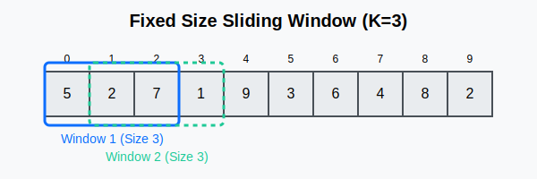
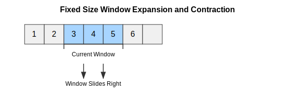
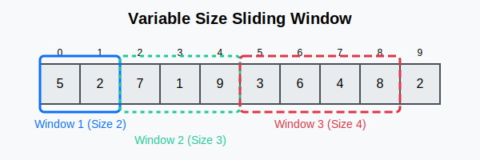
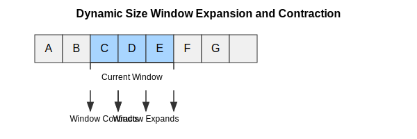
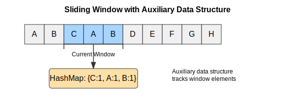
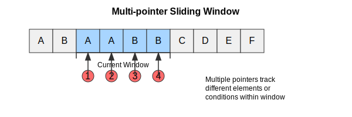
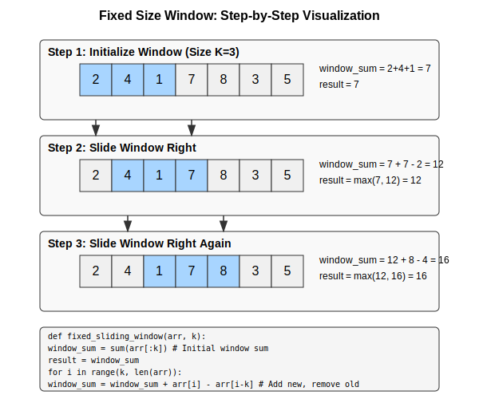
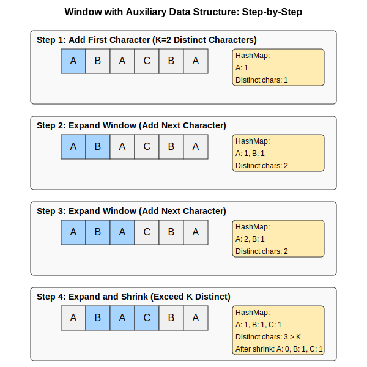
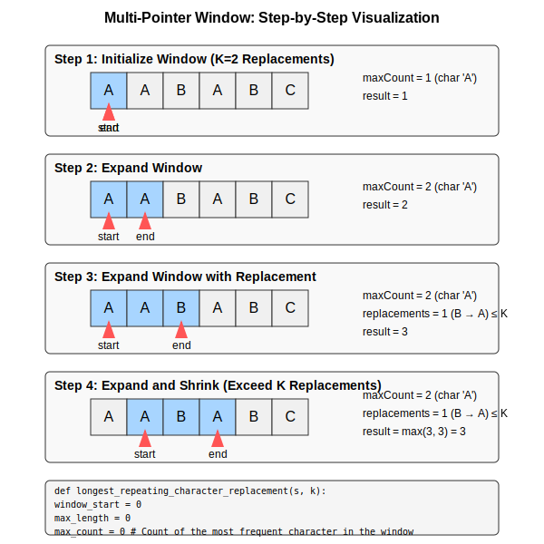

# Sliding Window Pattern

## What is the Sliding Window Pattern?

The Sliding Window pattern is a technique used to process arrays or lists in a sequential manner by maintaining a "window" of elements. This window can grow, shrink, or slide as needed to solve the problem efficiently.

## When to Use Sliding Window?

Use the Sliding Window pattern when you need to:

- Process contiguous subarrays or sublists
- Find maximum/minimum subarrays of a specific size
- Find subarrays that meet certain conditions
- Calculate running averages or sums

## Types of Sliding Window

### 1. Fixed Size Window

In this variation, the window size remains constant throughout the traversal.





**Use cases:**

- Find maximum/minimum sum subarray of size K
- Calculate moving average of size K
- Find all subarrays of size K with a specific property

### 2. Dynamic Size Window (Grow and Shrink)

In this variation, the window size can grow or shrink based on certain conditions.





**Use cases:**

- Find smallest subarray with sum greater than or equal to S
- Find longest substring with K distinct characters
- Find longest substring without repeating characters

### 3. Window with Auxiliary Data Structures

This variation uses additional data structures (like hash maps, heaps, or deques) to track information about the elements in the window.



**Use cases:**

- Find anagrams in a string
- Sliding window maximum/minimum
- Substring with concatenation of all words

### 4. Multi-pointer Window

This variation uses multiple pointers within the window to track different conditions or requirements.



**Use cases:**

- Longest repeating character replacement
- Substring with at most K distinct characters
- Maximum consecutive ones after K replacements

## How It Works

1. Start with a window of initial size (often 0 or 1)
2. Expand the window by adding elements from the right
3. When a certain condition is met, contract the window from the left
4. Keep track of the answer during this process

### Step-by-Step Visualizations

#### Fixed Size Window Step-by-Step



#### Dynamic Size Window Step-by-Step


#### Window with Auxiliary Data Structure Step-by-Step



#### Multi-Pointer Window Step-by-Step



## Code Templates

### Fixed Size Window

#### Python

```python
def fixed_sliding_window(arr, k):
    # Initialize variables
    window_sum = sum(arr[:k])
    result = window_sum
    
    # Slide the window
    for i in range(k, len(arr)):
        # Add the next element and remove the first element of the previous window
        window_sum = window_sum + arr[i] - arr[i-k]
        result = max(result, window_sum)  # or min, depending on the problem
    
    return result
```

#### Java

```java
public int fixedSlidingWindow(int[] arr, int k) {
    // Initialize variables
    int windowSum = 0;
    for (int i = 0; i < k; i++) {
        windowSum += arr[i];
    }
    int result = windowSum;
    
    // Slide the window
    for (int i = k; i < arr.length; i++) {
        // Add the next element and remove the first element of the previous window
        windowSum = windowSum + arr[i] - arr[i-k];
        result = Math.max(result, windowSum);  // or Math.min, depending on the problem
    }
    
    return result;
}
```

### 2. Dynamic Size Window (Grow and Shrink)

#### Python Implementation

```python
def dynamic_sliding_window(arr, target):
    window_start = 0
    window_sum = 0
    min_length = float('inf')  # or 0, depending on the problem
    
    for window_end in range(len(arr)):
        window_sum += arr[window_end]  # Add the next element
        
        # Shrink the window as small as possible until the condition is no longer met
        while window_sum >= target:  # Condition depends on the problem
            min_length = min(min_length, window_end - window_start + 1)
            window_sum -= arr[window_start]
            window_start += 1
    
    return min_length if min_length != float('inf') else 0
```

#### Java Implementation

```java
public int dynamicSlidingWindow(int[] arr, int target) {
    int windowStart = 0;
    int windowSum = 0;
    int minLength = Integer.MAX_VALUE;  // or 0, depending on the problem
    
    for (int windowEnd = 0; windowEnd < arr.length; windowEnd++) {
        windowSum += arr[windowEnd];  // Add the next element
        
        // Shrink the window as small as possible until the condition is no longer met
        while (windowSum >= target) {  // Condition depends on the problem
            minLength = Math.min(minLength, windowEnd - windowStart + 1);
            windowSum -= arr[windowStart];
            windowStart++;
        }
    }
    
    return minLength == Integer.MAX_VALUE ? 0 : minLength;
}
```

### 3. Window with Auxiliary Data Structures

#### Python Implementation

```python
def sliding_window_with_hashmap(s, k):
    window_start = 0
    max_length = 0
    char_frequency = {}  # Auxiliary data structure (HashMap)
    
    for window_end in range(len(s)):
        right_char = s[window_end]
        # Update the auxiliary data structure
        if right_char not in char_frequency:
            char_frequency[right_char] = 0
        char_frequency[right_char] += 1
        
        # Shrink the window if needed based on the auxiliary data structure
        while len(char_frequency) > k:  # Using the auxiliary data structure in the condition
            left_char = s[window_start]
            char_frequency[left_char] -= 1
            if char_frequency[left_char] == 0:
                del char_frequency[left_char]
            window_start += 1
        
        max_length = max(max_length, window_end - window_start + 1)
    
    return max_length
```

#### Java Implementation

```java
public int slidingWindowWithHashMap(String s, int k) {
    int windowStart = 0;
    int maxLength = 0;
    Map<Character, Integer> charFrequency = new HashMap<>();  // Auxiliary data structure
    
    for (int windowEnd = 0; windowEnd < s.length(); windowEnd++) {
        char rightChar = s.charAt(windowEnd);
        // Update the auxiliary data structure
        charFrequency.put(rightChar, charFrequency.getOrDefault(rightChar, 0) + 1);
        
        // Shrink the window if needed based on the auxiliary data structure
        while (charFrequency.size() > k) {  // Using the auxiliary data structure in the condition
            char leftChar = s.charAt(windowStart);
            charFrequency.put(leftChar, charFrequency.get(leftChar) - 1);
            if (charFrequency.get(leftChar) == 0) {
                charFrequency.remove(leftChar);
            }
            windowStart++;
        }
        
        maxLength = Math.max(maxLength, windowEnd - windowStart + 1);
    }
    
    return maxLength;
}
```

### 4. Multi-pointer Window

#### Python

```python
def longest_repeating_character_replacement(s, k):
    window_start = 0
    max_length = 0
    max_repeat_count = 0  # Track the count of the most frequent character
    char_frequency = {}
    
    for window_end in range(len(s)):
        right_char = s[window_end]
        if right_char not in char_frequency:
            char_frequency[right_char] = 0
        char_frequency[right_char] += 1
        
        # Update the count of the most frequent character
        max_repeat_count = max(max_repeat_count, char_frequency[right_char])
        
        # If the number of characters to replace exceeds k, shrink the window
        current_window_length = window_end - window_start + 1
        if current_window_length - max_repeat_count > k:
            left_char = s[window_start]
            char_frequency[left_char] -= 1
            window_start += 1
        
        max_length = max(max_length, window_end - window_start + 1)
    
    return max_length
```

#### Java

```java
public int longestRepeatingCharacterReplacement(String s, int k) {
    int windowStart = 0;
    int maxLength = 0;
    int maxRepeatCount = 0;  // Track the count of the most frequent character
    Map<Character, Integer> charFrequency = new HashMap<>();
    
    for (int windowEnd = 0; windowEnd < s.length(); windowEnd++) {
        char rightChar = s.charAt(windowEnd);
        charFrequency.put(rightChar, charFrequency.getOrDefault(rightChar, 0) + 1);
        
        // Update the count of the most frequent character
        maxRepeatCount = Math.max(maxRepeatCount, charFrequency.get(rightChar));
        
        // If the number of characters to replace exceeds k, shrink the window
        int currentWindowLength = windowEnd - windowStart + 1;
        if (currentWindowLength - maxRepeatCount > k) {
            char leftChar = s.charAt(windowStart);
            charFrequency.put(leftChar, charFrequency.get(leftChar) - 1);
            windowStart++;
        }
        
        maxLength = Math.max(maxLength, windowEnd - windowStart + 1);
    }
    
    return maxLength;
}
```

## Example Problems

### Example: Maximum Sum Subarray of Size K

**Problem:** Find the maximum sum of any contiguous subarray of size K.

**Solution:**

```python
def max_sum_subarray(arr, k):
    max_sum = 0
    window_sum = 0
    
    for i in range(len(arr)):
        window_sum += arr[i]
        
        if i >= k - 1:
            max_sum = max(max_sum, window_sum)
            window_sum -= arr[i - (k - 1)]
    
    return max_sum
```

### 2. Dynamic Size Window: Smallest Subarray with Sum Greater than or Equal to S

**Problem:** Find the length of the smallest contiguous subarray whose sum is greater than or equal to S.

**Solution:**

```python
def smallest_subarray_with_given_sum(arr, s):
    window_sum = 0
    min_length = float('inf')
    window_start = 0
    
    for window_end in range(len(arr)):
        window_sum += arr[window_end]
        
        while window_sum >= s:
            min_length = min(min_length, window_end - window_start + 1)
            window_sum -= arr[window_start]
            window_start += 1
    
    return min_length if min_length != float('inf') else 0
```

### Example: Longest Substring with K Distinct Characters

**Problem:** Find the length of the longest substring with at most K distinct characters.

**Solution:**

```python
def longest_substring_with_k_distinct(s, k):
    window_start = 0
    max_length = 0
    char_frequency = {}
    
    for window_end in range(len(s)):
        right_char = s[window_end]
        if right_char not in char_frequency:
            char_frequency[right_char] = 0
        char_frequency[right_char] += 1
        
        while len(char_frequency) > k:
            left_char = s[window_start]
            char_frequency[left_char] -= 1
            if char_frequency[left_char] == 0:
                del char_frequency[left_char]
            window_start += 1
        
        max_length = max(max_length, window_end - window_start + 1)
    
    return max_length
```

### 4. Multi-pointer Window: Longest Repeating Character Replacement

**Problem:** Find the length of the longest substring containing the same letter after replacing at most K characters.

**Solution:**

```python
def longest_repeating_character_replacement(s, k):
    window_start = 0
    max_length = 0
    max_repeat_count = 0  # Track the count of the most frequent character
    char_frequency = {}
    
    for window_end in range(len(s)):
        right_char = s[window_end]
        if right_char not in char_frequency:
            char_frequency[right_char] = 0
        char_frequency[right_char] += 1
        
        # Update the count of the most frequent character
        max_repeat_count = max(max_repeat_count, char_frequency[right_char])
        
        # If the number of characters to replace exceeds k, shrink the window
        current_window_length = window_end - window_start + 1
        if current_window_length - max_repeat_count > k:
            left_char = s[window_start]
            char_frequency[left_char] -= 1
            window_start += 1
        
        max_length = max(max_length, window_end - window_start + 1)
    
    return max_length
```

### 5. Sliding Window with Deque: Maximum in Sliding Window

**Problem:** Given an array and a sliding window of size k, find the maximum for each window position.

**Solution:**

```python
from collections import deque

def max_sliding_window(nums, k):
    result = []
    window = deque()  # Will store indices
    
    for i in range(len(nums)):
        # Remove elements outside the current window
        while window and window[0] < i - k + 1:
            window.popleft()
        
        # Remove smaller elements as they won't be the maximum
        while window and nums[window[-1]] < nums[i]:
            window.pop()
        
        # Add current element's index
        window.append(i)
        
        # Add to result if we've reached window size
        if i >= k - 1:
            result.append(nums[window[0]])  # window[0] contains the index of the maximum element
    
    return result
```

## LeetCode Problems Using Sliding Window

### Fixed Size Window Problems

1. [Maximum Subarray (LeetCode #53)](https://leetcode.com/problems/maximum-subarray/)
2. [Maximum Average Subarray I (LeetCode #643)](https://leetcode.com/problems/maximum-average-subarray-i/)
3. [Subarray Product Less Than K (LeetCode #713)](https://leetcode.com/problems/subarray-product-less-than-k/)

### Dynamic Size Window Problems

1. [Minimum Size Subarray Sum (LeetCode #209)](https://leetcode.com/problems/minimum-size-subarray-sum/)
2. [Longest Substring Without Repeating Characters (LeetCode #3)](https://leetcode.com/problems/longest-substring-without-repeating-characters/)
3. [Fruit Into Baskets (LeetCode #904)](https://leetcode.com/problems/fruit-into-baskets/)

### Window with Auxiliary Data Structures Problems

1. [Longest Substring with At Most K Distinct Characters (LeetCode #340)](https://leetcode.com/problems/longest-substring-with-at-most-k-distinct-characters/)
2. [Permutation in String (LeetCode #567)](https://leetcode.com/problems/permutation-in-string/)
3. [Find All Anagrams in a String (LeetCode #438)](https://leetcode.com/problems/find-all-anagrams-in-a-string/)

### Multi-pointer Window Problems

1. [Longest Repeating Character Replacement (LeetCode #424)](https://leetcode.com/problems/longest-repeating-character-replacement/)
2. [Max Consecutive Ones III (LeetCode #1004)](https://leetcode.com/problems/max-consecutive-ones-iii/)
3. [Substring with Concatenation of All Words (LeetCode #30)](https://leetcode.com/problems/substring-with-concatenation-of-all-words/)

## Time and Space Complexity

- **Time Complexity**: O(N) where N is the size of the input array/string. In the worst case, each element might be processed twice (once when it enters the window and once when it exits).
- **Space Complexity**: O(1) for fixed-size window problems with simple data. O(K) for problems involving distinct elements, where K is the size of the window or the number of distinct elements.

## Tips and Tricks

1. Always check if the window size is valid before processing
2. Be careful with window boundaries (off-by-one errors)
3. For string problems, use a hash map to track character frequencies
4. For fixed window problems, you can optimize by just adding the new element and removing the oldest one
5. For problems requiring all subarrays/substrings, the time complexity might be higher (e.g., O(N²))
