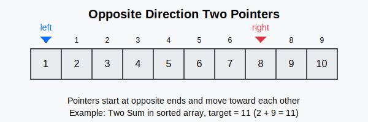
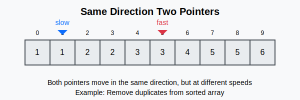
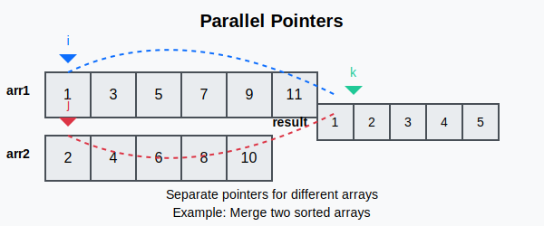

# Two Pointers Pattern

## What is the Two Pointers Pattern?

The Two Pointers pattern is a technique that uses two pointers to iterate through a data structure (usually an array or linked list) in a single pass. By using two pointers instead of nested loops, we can often reduce the time complexity from O(n²) to O(n).

## When to Use Two Pointers?

Use the Two Pointers pattern when you need to:
- Find a pair of elements in a sorted array that satisfy certain conditions
- Detect cycles in a linked list
- Reverse an array or linked list in-place
- Remove duplicates from a sorted array
- Find triplets or subarrays with specific properties

## Types of Two Pointers

### 1. Opposite Direction (Left and Right)

In this approach, one pointer starts from the beginning of the array, and another starts from the end. They move toward each other until they meet or a condition is satisfied.



**Use cases:**
- Two Sum (sorted array)
- Container With Most Water
- Trapping Rain Water
- Palindrome verification

### 2. Same Direction (Fast and Slow)

In this approach, both pointers start from the beginning, but they move at different speeds or with different conditions.



**Use cases:**
- Remove duplicates from sorted array
- Finding middle element of linked list
- Linked list cycle detection
- Sliding window problems

### 3. Multiple Arrays (Parallel Pointers)

In this approach, we use separate pointers for different arrays or different parts of the same array.



**Use cases:**
- Merge sorted arrays
- Intersection of two arrays
- Comparing strings

## How It Works

1. Initialize two pointers based on the problem requirements
2. Move the pointers according to specific conditions
3. Process the elements at the pointer positions
4. Continue until pointers meet or other termination conditions



## Code Templates

### Opposite Direction (Left and Right)

#### Python
```python
def two_pointers_opposite(arr):
    left, right = 0, len(arr) - 1
    result = None
    
    while left < right:
        # Process current elements
        current_sum = arr[left] + arr[right]
        
        if current_sum == target:
            result = [left, right]
            break
        elif current_sum < target:
            left += 1  # Move left pointer to increase sum
        else:
            right -= 1  # Move right pointer to decrease sum
    
    return result
```

#### Java
```java
public int[] twoPointersOpposite(int[] arr, int target) {
    int left = 0;
    int right = arr.length - 1;
    
    while (left < right) {
        // Process current elements
        int currentSum = arr[left] + arr[right];
        
        if (currentSum == target) {
            return new int[] {left, right};
        } else if (currentSum < target) {
            left++;  // Move left pointer to increase sum
        } else {
            right--;  // Move right pointer to decrease sum
        }
    }
    
    return new int[] {-1, -1};  // No solution found
}
```

### Same Direction (Fast and Slow)

#### Python
```python
def two_pointers_same_direction(arr):
    slow = 0  # Slow pointer
    
    for fast in range(1, len(arr)):  # Fast pointer
        if arr[fast] != arr[slow]:
            slow += 1
            arr[slow] = arr[fast]
    
    return slow + 1  # Length of array without duplicates
```

#### Java
```java
public int twoPointersSameDirection(int[] arr) {
    int slow = 0;  // Slow pointer
    
    for (int fast = 1; fast < arr.length; fast++) {  // Fast pointer
        if (arr[fast] != arr[slow]) {
            slow++;
            arr[slow] = arr[fast];
        }
    }
    
    return slow + 1;  // Length of array without duplicates
}
```

### Multiple Arrays (Parallel Pointers)

#### Python
```python
def merge_sorted_arrays(arr1, arr2):
    result = []
    i, j = 0, 0  # Pointers for arr1 and arr2
    
    while i < len(arr1) and j < len(arr2):
        if arr1[i] < arr2[j]:
            result.append(arr1[i])
            i += 1
        else:
            result.append(arr2[j])
            j += 1
    
    # Add remaining elements
    while i < len(arr1):
        result.append(arr1[i])
        i += 1
    
    while j < len(arr2):
        result.append(arr2[j])
        j += 1
    
    return result
```

#### Java
```java
public int[] mergeSortedArrays(int[] arr1, int[] arr2) {
    int[] result = new int[arr1.length + arr2.length];
    int i = 0, j = 0, k = 0;  // Pointers for arr1, arr2, and result
    
    while (i < arr1.length && j < arr2.length) {
        if (arr1[i] < arr2[j]) {
            result[k++] = arr1[i++];
        } else {
            result[k++] = arr2[j++];
        }
    }
    
    // Add remaining elements
    while (i < arr1.length) {
        result[k++] = arr1[i++];
    }
    
    while (j < arr2.length) {
        result[k++] = arr2[j++];
    }
    
    return result;
}
```

## Example Problems

### 1. Two Sum II - Input Array Is Sorted (LeetCode #167)

**Problem:** Given a sorted array of integers, find two numbers such that they add up to a specific target number.

**Solution:**

```python
def two_sum_sorted(numbers, target):
    left, right = 0, len(numbers) - 1
    
    while left < right:
        current_sum = numbers[left] + numbers[right]
        
        if current_sum == target:
            return [left + 1, right + 1]  # 1-indexed array
        elif current_sum < target:
            left += 1
        else:
            right -= 1
    
    return [-1, -1]  # No solution found
```

### 2. Remove Duplicates from Sorted Array (LeetCode #26)

**Problem:** Remove duplicates from a sorted array in-place and return the new length.

**Solution:**

```python
def remove_duplicates(nums):
    if not nums:
        return 0
    
    slow = 0
    
    for fast in range(1, len(nums)):
        if nums[fast] != nums[slow]:
            slow += 1
            nums[slow] = nums[fast]
    
    return slow + 1
```

### 3. 3Sum (LeetCode #15)

**Problem:** Find all unique triplets in the array that give the sum of zero.

**Solution:**

```python
def three_sum(nums):
    nums.sort()
    result = []
    
    for i in range(len(nums) - 2):
        # Skip duplicates
        if i > 0 and nums[i] == nums[i - 1]:
            continue
        
        left, right = i + 1, len(nums) - 1
        
        while left < right:
            total = nums[i] + nums[left] + nums[right]
            
            if total < 0:
                left += 1
            elif total > 0:
                right -= 1
            else:
                result.append([nums[i], nums[left], nums[right]])
                
                # Skip duplicates
                while left < right and nums[left] == nums[left + 1]:
                    left += 1
                while left < right and nums[right] == nums[right - 1]:
                    right -= 1
                
                left += 1
                right -= 1
    
    return result
```

## LeetCode Problems Using Two Pointers

1. [Two Sum II - Input Array Is Sorted (LeetCode #167)](https://leetcode.com/problems/two-sum-ii-input-array-is-sorted/)
2. [Remove Duplicates from Sorted Array (LeetCode #26)](https://leetcode.com/problems/remove-duplicates-from-sorted-array/)
3. [3Sum (LeetCode #15)](https://leetcode.com/problems/3sum/)
4. [Container With Most Water (LeetCode #11)](https://leetcode.com/problems/container-with-most-water/)
5. [Trapping Rain Water (LeetCode #42)](https://leetcode.com/problems/trapping-rain-water/)
6. [Valid Palindrome (LeetCode #125)](https://leetcode.com/problems/valid-palindrome/)
7. [Merge Sorted Array (LeetCode #88)](https://leetcode.com/problems/merge-sorted-array/)
8. [Sort Colors (LeetCode #75)](https://leetcode.com/problems/sort-colors/)

## Time and Space Complexity

- **Time Complexity**: Usually O(n) where n is the size of the input array or linked list. For some problems like 3Sum, it might be O(n²).
- **Space Complexity**: Usually O(1) as we're only using two pointers and not any additional data structures that scale with input size.

## Tips and Tricks

1. For problems involving pairs, triplets, or subarrays, consider sorting the array first
2. Be careful with boundary conditions (when pointers meet or cross)
3. For problems requiring in-place operations, the two pointers technique is often ideal
4. When dealing with linked lists, consider using the fast and slow pointers approach
5. For problems where you need to find all combinations, consider using a third pointer as an anchor
